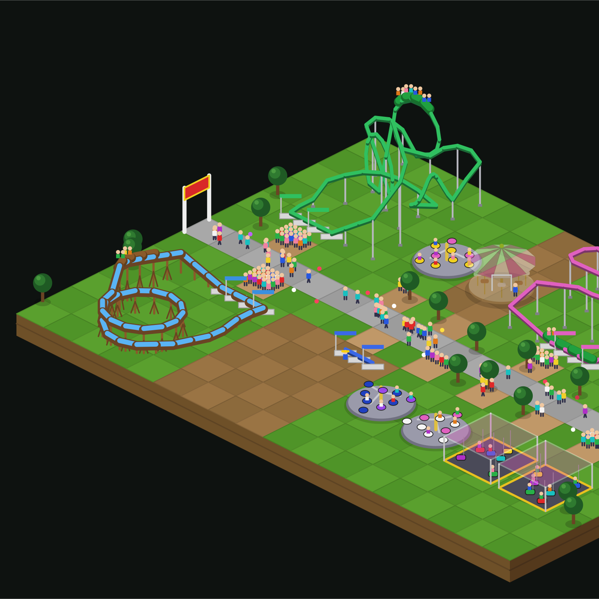
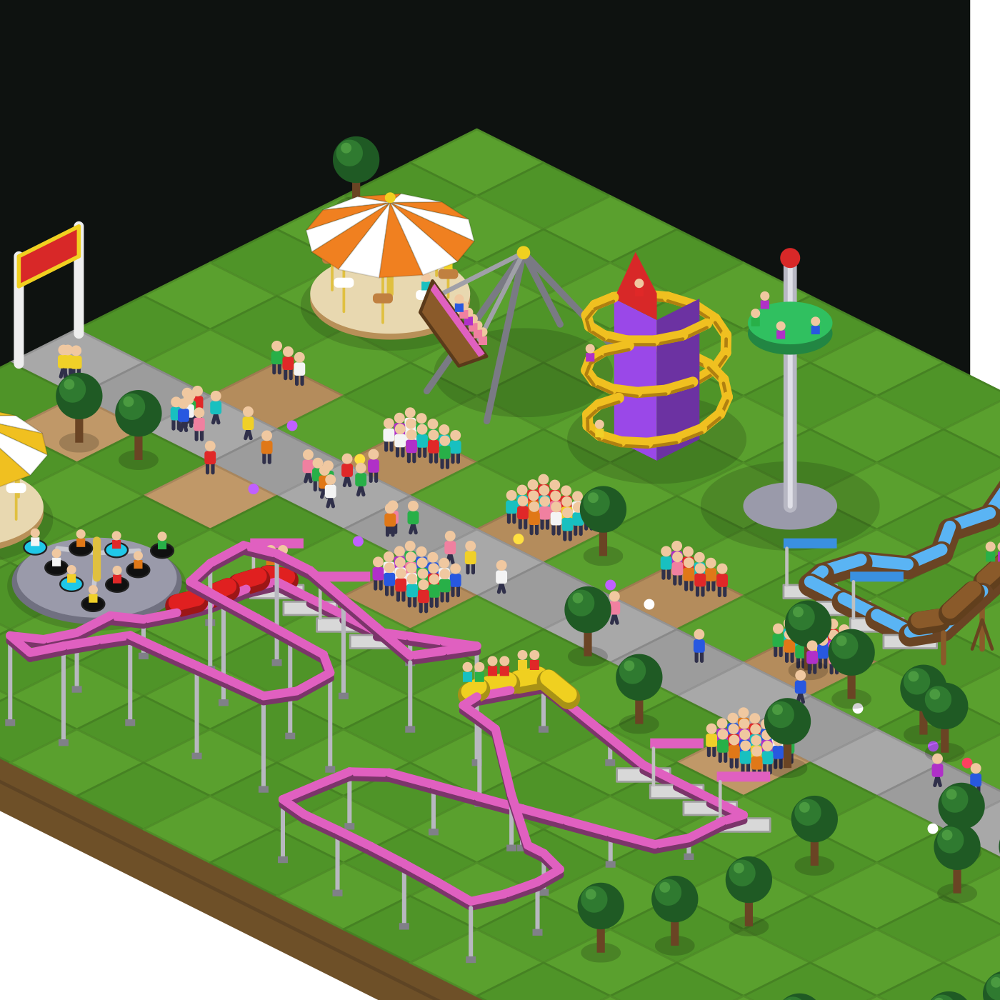

# 🎢 Claude Coaster Tycoon

**Claude builds you a theme park while it works.** Every tool call Claude Code makes lays track. Finished coasters get a test run, then crowds pour in. Your park grows with your project, and parks compete on a global leaderboard.

A Claude Code mod in the spirit of the original RollerCoaster Tycoon.

**Quick start:** paste this into Claude Code and let it do the rest:

```
Install the Claude Coaster Tycoon mod from github.com/thickiran/claude-coaster-tycoon
```

Or install it yourself in two commands ([below](#install)).



## How it plays

| Claude does | Your park does |
| --- | --- |
| Calls a tool | The crew lays track: an edit or write 3–4 pieces, a command 2, a read or search 1 |
| Finishes a ride | An empty test train runs a lap |
| Gets interrupted mid-build, or lots of commands fail | The test train derails 💥 and the ride waits for repairs |
| Passes a test | The ride opens with Excitement / Intensity / Nausea ratings, and guests queue up |

**Which model works decides what gets built.** Each model has its own crew, so a Haiku subagent builds beside Opus:

| Model | Crew builds |
| --- | --- |
| Opus / Fable | Big coasters: wooden, steel twister, corkscrew, mine train, looping, hyper |
| Sonnet | Family rides: Wild Mouse, Junior Coaster, Log Flume, Ferris Wheel, Swinging Ship, Observation Tower |
| Haiku | Flat rides: Merry-Go-Round, Spiral Slide, Dodgems, Twist |

Every coaster is different: oval, figure-8, out-and-back, helix or free-form layouts, with loops, corkscrews and their own heights and colours.



**One park per project.** Each git repository (or folder) has its own park, saved between sessions.

## Install

In Claude Code:

```
/plugin marketplace add thickiran/claude-coaster-tycoon
/plugin install coaster-tycoon@claude-coaster-tycoon
```

Then start a session and give Claude some work. The park opens in a pane; `/park` reopens it.

> **Requires a Claude Code build with plugin function hooks (mods).** The API is early access and may change between releases. If the pane never appears, your build may not have it yet.

The desktop app draws the park as crisp vector art. The terminal draws it in coloured pixel blocks, and the view follows the construction site.

## Commands

| Command | |
| --- | --- |
| `/park` | Open the park |
| `/park top` | The global leaderboard |
| `/park join [name]` | Enter this park on the leaderboard |
| `/park name <name>` | Rename the park as the leaderboard shows it |
| `/park leave` | Take this park off the leaderboard |
| `/park reset` | Bulldoze and start over |

## The global leaderboard

Joining is opt-in, per park, and needs the [GitHub CLI](https://cli.github.com) signed in (`gh auth login`).

- `/park join` creates a public gist on **your** GitHub account holding your park's stats, and files a one-time registration issue on this repo.
- While you play, the mod updates that gist every 10 minutes.
- A [GitHub Action](.github/workflows/leaderboard.yml) runs every 20 minutes. It reads every registered gist, checks the numbers, recomputes each score and publishes [`leaderboard/leaderboard.json`](leaderboard/leaderboard.json), which the mod shows in the pane.

**What is shared:** the park's display name, park rating, guests, rides open, coasters, total riders, money and its best ride's name. **Never** file paths, code, prompts or anything else from your machine. The park name defaults to the folder name, so rename it with `/park name` if that's private.

**Score** = park rating × (1 + 0.25 × rides open) + total guests × 0.05 + total riders × 0.02.

It's an honour-system leaderboard for fun: the Action rejects impossible numbers, but a determined person could edit their gist by hand.

## Cost

Nothing. No servers: GitHub hosts the code, runs the Action and serves the leaderboard, all free for public repositories.

## Developing

Agents (and humans): start with [AGENTS.md](AGENTS.md), which has the repo map, architecture, the rules that trip people up, and recipes for adding rides.

```bash
npm test          # leaderboard tests, an offline render, plugin + marketplace validation
npm run preview   # render a simulated park to preview.svg and look at it
```

The mod is `plugins/coaster-tycoon/`:

- `hooks/register.tsx`: hooks for tool calls, turns, the pane, `/park` and the leaderboard
- `hooks/sim.ts`: rides, layouts, trains, guests, ratings and money
- `hooks/vector.ts`: the desktop's isometric vector renderer
- `hooks/draw.ts`: the terminal's pixel renderer
- `hooks/board.ts`: leaderboard stats and score

Load a local copy with `claude --plugin-dir plugins/coaster-tycoon`.

Ideas and pull requests welcome: new rides, layouts, scenery, sounds.

## License

[MIT](LICENSE)
